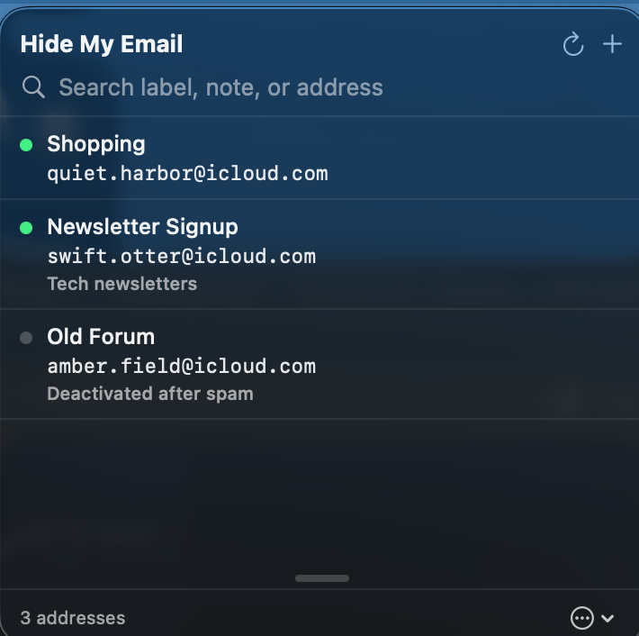

# Masque

A small macOS **menu bar app** for Apple **Hide My Email**: create new addresses,
search/manage existing ones, all from the menu bar.



## Status

- ✅ Full SwiftUI `MenuBarExtra` UI: sign in → 2FA → list/search → create → edit / activate / deactivate / delete.
- ✅ Native iCloud auth (SRP-6a + 2FA + trust token) reimplemented in Swift, **verified byte-for-byte against the reference `pysrp` implementation** (`MasqueTests`).
- ✅ Live Hide My Email client (generate / reserve / list / deactivate / reactivate / delete / updateMetaData).
- ✅ Runs against in-memory mock data for UI work (`-mock`).

## ⚠️ Important: this uses *unofficial* iCloud endpoints

Apple publishes **no** public API for Hide My Email. Masque talks to the same
private web endpoints (`idmsa.apple.com/appleauth`, `setup.icloud.com`,
`*-maildomains.icloud.com`) that the icloud.com web client and the well-known
"Hide My Email" browser extension use. That means:

- These endpoints can change or break without notice.
- Your Apple ID + password are sent **only to Apple** (over TLS, via the SRP
  handshake — the password itself never leaves the device in cleartext) and are
  **never stored**. Only Apple's *trust token* is saved (in the Keychain) so you
  can skip 2FA on the next sign-in.
- Use it on your own account, at your own discretion.

## Build

Requires Xcode 26+, [XcodeGen](https://github.com/yonaskolb/XcodeGen)
(`brew install xcodegen`), and the [BigInt](https://github.com/attaswift/BigInt)
Swift package (resolved automatically).

```sh
cd macos
xcodegen generate          # regenerate Masque.xcodeproj (git-ignored)
open Masque.xcodeproj       # ⌘R to run, ⌘U to test
```

Or from the CLI:

```sh
cd macos
DEVELOPER_DIR=/Applications/Xcode.app/Contents/Developer \
  xcodebuild -scheme Masque -destination 'platform=macOS' build
```

### Mock vs. live

- **Live (default):** talks to real iCloud. Sign in with your Apple ID + 2FA.
- **Mock:** launch with `-mock` (or `MASQUE_MOCK=1`) for fake in-memory data,
  no network. Handy for UI work. In mock mode the 2FA code is `123456`.

## Architecture

```
macos/App/
  MasqueApp.swift              MenuBarExtra scene; picks mock/live service
  Models/HMEAddress.swift      the HME record + search matching
  ViewModels/AppState.swift    @MainActor state machine (screens, intents)
  Views/                       MenuRoot, Login, TwoFactor, AddressList, Row, Create, Edit
  Services/
    ICloudService.swift        protocol the UI depends on (+ ICloudError)
    MockICloudService.swift    in-memory fake
    ICloudLiveService.swift    actor: SRP + 2FA + accountLogin
    ICloudLiveService+HME.swift  Hide My Email endpoints (list=v2, rest=v1)
    KeychainStore.swift        persists the trust token
    Crypto/
      CryptoUtils.swift        SHA-256, PBKDF2 (s2k/s2k_fo), long_to_bytes/pad
      SRPClient.swift          SRP-6a (pysrp-exact: NG_2048, SHA-256, no_username_in_x)
macos/Tests/
  SRPClientTests.swift         pins A / M1 / M2 / s2k / s2k_fo to pysrp vectors
```

The UI is written against the `ICloudService` protocol, so the whole flow can be
exercised on the mock before hitting Apple. The live service is an `actor`, so
session state (cookies, session/trust tokens, the `premiummailsettings` host) is
race-free.

## Known limitations / ideas

- Cookies live in-memory, so a cold launch needs a fresh sign-in (password only —
  the stored trust token skips 2FA). Persisting the cookie jar to the Keychain
  and calling `setup.icloud.com/validate` would enable true silent restore.
- Trusted-device 2FA only (no SMS-code path yet).
- No global hotkey / Spotlight-style quick create (nice future addition).
